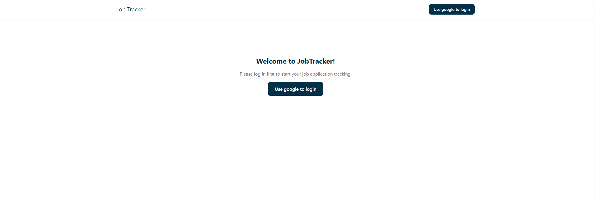
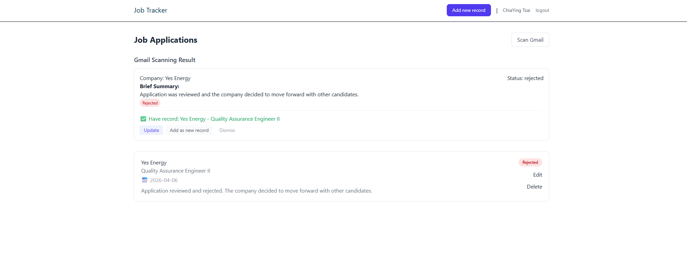

# Job Tracker

A full-stack job application tracking tool with Gmail integration and AI-powered email analysis.

## Featyres

- **Google OAuth 2.0** - Secure Login with Google account
- **Job Application CRUD** - Add, Edit, and delete job applications
- **Gmail Integration** - Automatically scan job-related emails from Gmail
- **AI analysis** - Claude AI analyzes emails to extract company, position, and application status
- **Smart Match Detection** - Detect whether a scanned email matches an existing record or is a new application

## Tech Stack

### Frontend
- React + Vite
- Tailwind CSS
- React Router DOM
- Axios

### Backend
- Node.js + Express
- Passport.js (Google OAuth 2.0)
- Express Session + File Store
- Gmail API (googleapis)
- Claude API (@anthropic-ai/sdk)

## Getting Started

### Prerequisites
- Node.js
- Google Cloud Console account (for OAuth + Gmail API)
- Anthropic API key (for Claude AI)

### Installation

1. Clone the repo
```bash
git clone https://github.com/tsaicying/job-tracker.git
cd job-tracker
```

2. Install server dependencies
```bash
cd server
npm install
```

3. Install client dependencies
```bash
cd ../client
npm install
```

4. Set up environment variables

Create `server/.env`:

PORT=5000
GOOGLE_CLIENT_ID=your_google_client_id
GOOGLE_CLIENT_SECRET=your_google_client_secret
SESSION_SECRET=your_session_secret
CLIENT_URL=http://localhost:5173
ANTHROPIC_API_KEY=your_anthropic_api_key

5. Run the app

Start the server:
```bash
cd server
npm run dev
```

Start the client:
```bash
cd client
npm run dev
```

6. Open `http://localhost:5173` in your browser

## Screenshots

### Job Applications Dashboard


### Gmail Scan Results


## Future Improvements
- PostgreSQL database integration
- Deploy to Vercel + Railway
- Kanban board view